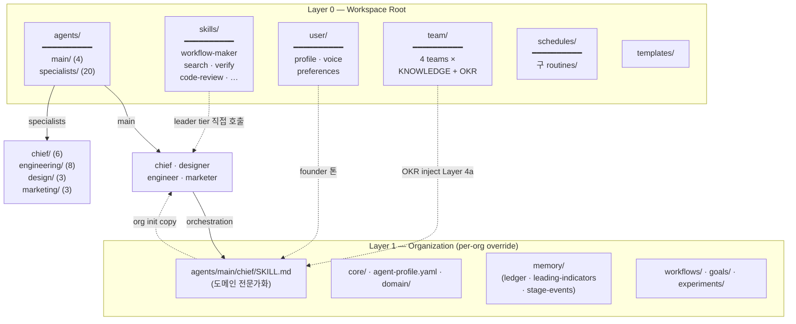
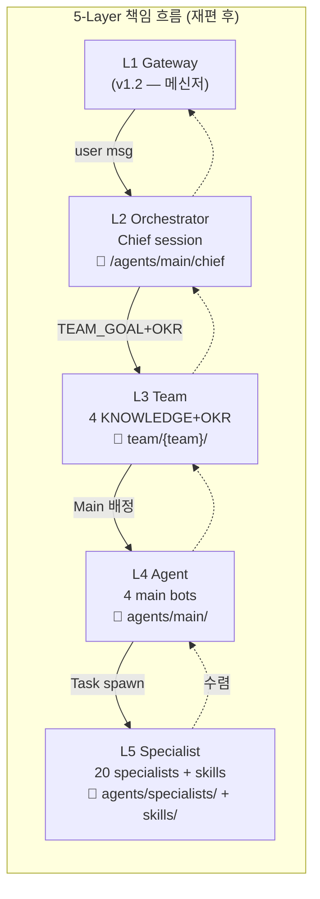

# v1.1 — Multi-Agent Team Architecture (에이전트 팀 + 워크플로우 구조 재설계)

> SoloSquad 의 *단일 PM session + Task tool* 패러다임을 **Team-Centric Multi-Agent** 로 격상. Hermes Agent V2 의 *5-layer 위계* (Gateway / Orchestrator / Team / Agent / Specialist) + Agno Team 2.0 의 *coordinate mode* + LangGraph supervisor 합의된 패턴 위에서, *Main Agent + Specialist Pool* 분리 + *Team Knowledge* 공유 + *Educational Nudge / Dependency Injection / Experiment Proposal / Board of Agents* 4 채택 권고 (Harness Report §7.5) 흡수. v1.x-workflow-goal-routine-evolution 의 ideation 7건 (Q1~Q7) 완전 흡수. **메신저 연결은 v1.2 별도 plan** (Gateway L1 위임).

**로드맵 위치:** v1.0.3 (publish 완료) → **v1.1 본 plan (에이전트 팀 + 워크플로우)** → v1.2 (메신저 연결 — Discord 우선 / Slack v1.2.x) → v1.x (대시보드 · 지식 온톨로지 · LLM backend 추상화)

**의존:**
- v0.4 (goal-runner CONFIRMING 상태머신)
- v0.5 (`SKILL.md` frontmatter parser + 4-channel router + workflow-maker 5단계)
- v0.6 (`agents/{team}/KNOWLEDGE.md` per-team shared knowledge §2.1 + 8-layer JIT context §2.2 + trajectory + freq miner + FTS5 archive)
- v0.8.0 (`<org>/.solosquad/users/<handle>.yaml` + multi-user channel 모델)
- v0.8.2 (`dev_capability` + dev-confirm gate)
- v1.0.1 (`@<slug>` mention parser + multi-repo intent)

**기준 버전:** v1.1.0. 신규 인프라 4건 (Main/Specialist 분리 + Team Knowledge layer 명시화 + Educational Nudge + Dependency Injection 지표 layer) + 기존 6 capability 고도화 (workflow-maker · goal-runner · routine · 실험 인프라 · leading indicator · 8-layer JIT). 새 CLI 명령 2건. schema 변경 1건 (SKILL frontmatter v1 → v2).

**분류:** Minor (semver). api-stability §3 *"새 CLI 명령 = minor"* 정합. v1.0.x patch 시리즈 *narrative 단절* 명시 — *작업 흐름 자체의 재설계*.

**범위 분리:**
- **v1.1 (본 plan):** L2~L5 (Orchestrator · Team · Agent · Specialist). 에이전트 팀 구조 + Workflow + Goal + Routine + 실험 인프라
- **v1.2 (별도 plan):** L1 (Gateway). 메신저 연결 — Channel topology · Bot Identity Registry · 9-hop diagnostic · Forum Channel · Mention routing · Echo guard · Thread budget · v1.0.4 G+H+P 흡수

---

## 0. v1.x ideation 7건 흡수 박제

`docs/prd/v1.x-workflow-goal-routine-evolution.md` 의 ideation 답변 7건 (2026-05-15) 을 본 plan 으로 *완전 흡수*. 본 plan publish 후 원본 doc 은 *역사적 reference* 로 격하.

| Q | 답변 | 본 plan 흡수 위치 |
|---|---|---|
| Q1. 3축 leading indicator | (b) 24/7 자율 팀 우위 | §11 Leading Indicator |
| Q2. 암묵지 → SKILL 1차 source | (b) 사용자 명시 슬래시 | §12 Workflow-Maker |
| Q3. 사용자별 권한 모델 | 불필요 | Out of scope (§16) |
| Q4. 워크플로우 인간 승인 지점 | (d) cycle 결과 ack + 중간 통지/개입 | §8 Goal-Runner |
| Q5. multi-product goal 모델 | 1 org × N goals, 1 active at a time | §8 Goal-Runner |
| Q6. 루틴 개인화 | 사용자별 | §10 Routine |
| Q7. 실험 인프라 | (a) 별도 인프라 + Amplitude 패턴 | §9 실험 인프라 |

본 박제로 *v1.x-workflow-goal-routine-evolution.md* 의 §1·§2·§3·§4·§5·§6 모두 흡수 완료 — 원본 doc 의 *살아있는 영역* = 변경 이력 + 외부 reference 만.

---

## 1. 핵심 질문 & 성공 기준

| 핵심 질문 | 성공 기준 |
|---|---|
| Hermes V2 의 *Main + Specialist 분리* 가 SoloSquad 25 SKILL 위에 자연 정합하나? | §4 — PM 봇 = Main, 25 specialist = Specialist Pool. PM 이 specialist 의 SKILL.md 를 *마치 도구처럼* 호출. Claude Code `Task` tool 위에서 직접 매핑 |
| Team Knowledge 가 8-layer JIT 의 어느 layer 와 정합하나? | §7 — Hermes V2 §4.2 4단계 (팀목표→팀지식→개인역할→현재상황) 가 v0.6 8-layer 의 layer 4 + 2 + 3 + 7 와 1:1 매핑. *완전 포함* |
| 25 SKILL frontmatter 신규 4 필드 (tier·domain_tags·routing_keywords·collab_role) 가 *기존 26 agent* 와 어떻게 정합하나? | §6 — migration script 가 team 기반 default 자동 채움. 사용자 ack 없이도 80% 자동 |
| Educational Nudge 가 PM SKILL.md 어디에 들어가나? | §13 — PM triage 의 stage 0 (막연도 점수 측정 → 관련 KNOWLEDGE.md slice 우선 제시) |
| Dependency Injection (지표) 가 8-layer 의 어느 layer 로 들어가나? | §7 — layer 6.5 신설 (stage 도메인 키워드 매칭 → signals.jsonl 자동 inject) |
| 실험 인프라가 `<org>/experiments/` 신설 + Amplitude 4 패턴 차용으로 자율 사이클 도는가? | §9 — manifest.yaml + data-collector·data-analyst SKILL + cron + decision emit |
| `solosquad goal queue <id>` 가 1-active-per-org 세마포어와 정합하나? | §8 — `<org>/goals/.active-goal` 세마포어 + queue → 자동 promote |

---

## 2. 외부 reference 합성

본 plan 의 reference base = `docs/ideation/2026-05-23-multi-agent-v1.1-synthesis.html` (4-way 비교 보고서) + 부속 자료들. 핵심만 박제:

### 2.1 Hermes V2 (Team-Centric 5-layer)

`docs/ideation/multi-agent-directory.md` (2026-05-23 V2 개정):

- **L1 Gateway** — 사용자 접점 (→ v1.2 위임)
- **L2 Orchestrator** — Workflow + Scheduler (지휘)
- **L3 Team** — Team Goal + Knowledge Base (지식 공유)
- **L4 Agent** — Main Agents (판단)
- **L5 Specialist** — Shared Sub-Agents + Skills (실행)

**SoloSquad 정합:** L3 = `assets/agents/{team}/KNOWLEDGE.md` (v0.6 §2.1) 와 *정확히 일치*. L4·L5 = Main + Specialist 분리 패턴 = SoloSquad v1.1 의 *5 코어 봇 (PM=Main, 4=specialist)* 모델로 한 단계 격상.

### 2.2 Harness Report — 4 채택 권고 (§7.5)

`docs/ideation/AI_Agent_Harness_Report.md` §7.5:

| # | 항목 | SoloSquad 적용 | 우선순위 |
|---|---|---|---|
| 1 | Educational Nudge | `orchestrator/SKILL.md` 에 "막연한 입력 → KNOWLEDGE.md 가이드 우선" 룰 | 높음 |
| 2 | Dependency Injection (지표) | 8-layer JIT 의 layer 6.5 — stage 도메인별 signals.jsonl 자동 inject | 높음 |
| 3 | Experiment Proposal 자율 노드 | goal-runner 에 `PROPOSE_NEXT` stage 추가 | 중 |
| 4 | Board of Agents 메타포 | `orchestrator/SKILL.md` 톤 조정 — "비서" → "이사회 의장" | 낮음 |

본 plan §13~§15 가 4 권고 모두 흡수.

### 2.3 7 framework supervisor 패턴 합의

`v1.1-multi-agent-messenger-collaboration.md` 의 부록 A2 (Agent C 합성 — 추후 본 doc 의 §A 로 복원):

- LangGraph Supervisor (langgraph-supervisor-py) — *production-deploy 최다*
- Microsoft Semantic Kernel Magentic — Manager + Task Ledger
- Agno Team 2.0 — Coordinate mode (leader + members)
- AutoGen v0.4 — GroupChatManager + Termination Algebra
- Claude Code subagents — Orchestrator-worker + isolated context (SoloSquad 이미 채택)
- OpenAI Agents SDK — Handoff + Tracing
- CrewAI — Hierarchical (manager + workers)

**공통 합의:** Supervisor 패턴이 production 표준. 본 plan §5 PM Supervisor 채택.

### 2.4 사용자 segment 박제

본 plan 은 **완전 비개발 사용자 + 바이브코딩** segment 를 명시 *반대* 의 segment 가 아니라 *현재 사용자 (1인 dogfooder)* 의 한 단계 후 약속:

- v1.1.0 = *기술 hobbyist + 1인 founder dogfood* 수준 onboarding 유지
- v1.x deployment model 재설계 (SaaS 호스팅 + 웹 대시보드 + OAuth click) 는 *v1.x-dashboard-interaction* (cascade-shifted) 슬롯
- 본 plan 은 *내부 아키텍처 재설계* 만 — onboarding UX 는 별도

---

## 3. 5-Layer Team-Centric Architecture (Hermes V2 차용)

### 3.1 5-layer 매핑

| 계층 | 구성 | SoloSquad 구현 |
|---|---|---|
| L1. Gateway | Discord/Slack + Webhook | → **v1.2 plan** (메신저 어댑터·9-hop diagnostic·channel topology) |
| **L2. Orchestrator** | PM session + Scheduler | `src/bot/pm-runner.ts` + `src/scheduler/` + WorkflowReconciler |
| **L3. Team** | Team Goal + Knowledge Base | `assets/agents/{team}/KNOWLEDGE.md` (v0.6 §2.1) + `assets/agents/{team}/_team_goal.md` (신설) |
| **L4. Agent** | Main Agents (5 코어 봇) | PM 봇 (orchestrator) + 4 team 봇 (eng/design/growth/strategy) |
| **L5. Specialist** | Shared Sub-Agents + Skills | 25 SKILL.md + workflow-maker + executable tool (Bash/MCP) |

### 3.2 책임 단방향 흐름

```
L1 Gateway (v1.2)
  ↓ user msg / mention
L2 Orchestrator (PM = Supervisor)
  ↓ TEAM_GOAL + KNOWLEDGE 추출
L3 Team (assets/agents/{team}/)
  ↓ Main Agent 배정
L4 Agent (PM or team 봇)
  ↓ Specialist 호출 (Task tool)
L5 Specialist (25 SKILL.md + tools)
  ↓ 결과
L4 → L3 → L2 → L1 (역방향 수렴)
```

### 3.3 v0.6 8-layer JIT 와의 호환성

기존 v0.6 §2.2 8-layer JIT 의 *컨텍스트 layer* 와 본 5-layer *책임 위계* 는 *직교 관계*. 즉 본 5-layer 는 *코드 아키텍처* 의 위계이고, v0.6 8-layer 는 *spawn 시점 context 조립* 의 layer. 둘 다 유지.

---

## 4. 봇 직원화 — Main + Specialist 분리

### 4.1 5 코어 봇 (Main Agent layer, L4)

| 봇 | 매핑 SKILL/team | 책임 (Hermes V2 의 *main agent*) |
|---|---|---|
| `pm` | `assets/orchestrator/SKILL.md` | Supervisor — Triage / Decompose / Dispatch / Synthesize / Decide |
| `eng` | `engineering/` 10 agent | 코드·인프라·QA·보안 도메인 |
| `design` | `experience/` 4 agent | 리서치·UX·UI 도메인 |
| `growth` | `growth/` 4 agent | GTM·콘텐츠·브랜드·유료 마케팅 도메인 |
| `strategy` | `strategy/` 7 agent | 기획·PMF·feature·policy·data·business·idea 도메인 |

**Main Agent 의 역할 (Hermes V2 §4.3 인용):**
> 메인 에이전트는 서브 에이전트의 `DESCRIPTION.md`를 읽고, *마치 스킬을 쓰듯이* 서브 에이전트에게 사고(Reasoning) 업무를 요청한다.

SoloSquad 매핑:
- Main Agent = 5 코어 봇 (PM + 4 team)
- Specialist = 25 SKILL.md (각 team 안의 sub-skill)
- 호출 mechanism = Claude Code `Task` tool — 이미 채택

### 4.2 Specialist Pool (L5)

**Hermes V2 의 specialist 정의:**
> `specialists/` 폴더의 sub-agent = *독립된 인격체 + 고성능 지능 도구*. *재사용 가능* — 한 specialist 를 여러 main agent 가 호출 가능.

**SoloSquad 정합 + 차이:**

| Hermes V2 | SoloSquad v1.1 |
|---|---|
| `agents/specialists/` 단일 폴더 | `assets/agents/{team}/{specialist}/SKILL.md` — **team-bound** |
| Cross-team 재사용 (researcher 도 호출, writer 도 호출) | **Team-bound** — eng SKILL 은 eng 봇만 (권한 격리) |
| 예외: meta SKILL (`_meta/workflow-maker`) 는 cross-team — PM 도 직접 호출 |

**근거 (team-bound 유지):**
- v0.6 §2.1 `KNOWLEDGE.md` per team = team-bound 가 *이미 SoloSquad design*
- 권한 격리 (dev_capability 가 engineering team 만) — cross-team 시 책임 모호
- 25 specialist 가 *모두 cross-team* 이면 routing 결정 표면 크게 폭증 (LangGraph supervisor 의 *25 후보 오라우팅 폭발* 위험)

**Cross-team specialist 예외 (meta):**
- `_meta/workflow-maker` — PM 이 직접 호출. *어느 team 도 아닌* skill-author meta
- v1.x 후속: 사용자 자체 meta SKILL 작성 가능 (v1.x §4 b 흡수)

### 4.3 Bot Identity Registry — *간략* (구체는 v1.2)

각 봇이 자기 외 다른 봇들을 인지하기 위한 registry `<org>/.solosquad/bots.json` 가 필요. **본 plan 에서는 *존재 박제* 만**, 구체 스키마 + 9-hop diagnostic 은 *v1.2 plan §4*.

본 plan 의 영향:
- SKILL.md frontmatter 의 `bot_name` 필드 (§6) 가 registry 의 *어느 봇 소속* 결정
- workflow lifecycle (§9) 의 *어느 봇이 Task 실행* 결정에 사용

---

## 5. PM = Supervisor 패턴

### 5.1 책임 (7 framework supervisor 합의)

PM 봇의 6 stage 상태머신:

```
IDLE → TRIAGE → DECOMPOSE → DISPATCH → AWAIT → SYNTHESIZE → DECIDE → IDLE
              ↑                            ↓
              ↑                       (specialist 회신)
        (사용자 명령)
```

| Stage | 책임 | 외부 정합 |
|---|---|---|
| TRIAGE | 사용자 의도 분류 + *Educational Nudge* (§13) | LangGraph supervisor + Educational Nudge |
| DECOMPOSE | 과제 = subtask 1~N | Agno coordinate "decomposes into subtasks" |
| DISPATCH | 관련 Main Agent (team 봇) 호출 | Claude Code `Task` tool |
| AWAIT | specialist 회신 대기 (timeout 30분) | AutoGen `TimeoutTermination` |
| SYNTHESIZE | 결과 수렴 — *PM 단일 voice* | Salesforce Slackbot 정합 |
| DECIDE | `_decision.md` 발행 + 사용자 ack 요청 | Harness Report §4 reconciliation |

### 5.2 Routing — Deterministic Registry + LLM Fallback

PM 의 Task dispatch 결정:

1. **1차 (deterministic):** 사용자 메시지 → keyword 추출 → SKILL frontmatter 의 `domain_tags` + `routing_keywords` 매칭 → 후보 SKILL 셋
2. **2차 (LLM fallback):** 후보 0개 또는 2개 이상 → LLM 이 어느 SKILL 선택

**근거:** LangGraph 결론 — 순수 LLM routing 은 25 specialist 환경에서 오라우팅 폭발. *AGENTBALANCE backbone-then-topology* 합의.

### 5.3 Skill-Tiering (Agno Team 2.0 차용)

Hermes V2 +Agno 합의 패턴:

- **Leader tier:** PM 이 *직접 실행* (subagent spawn 없음). 짧고 빠른 SKILL — 예: `verify`, `code-review`, `workflow-maker`
- **Member tier:** PM 이 specialist 봇 dispatch (Task tool spawn). 무거운 작업 — 예: `architect`, `fde`, `ux-designer`

**구현:** SKILL.md frontmatter 의 `tier` 필드 (§6). v1.1.0 default = 모든 specialist = `member`, meta (`workflow-maker`) = `leader`.

**효과:** Anthropic 측정 — multi-agent = 15× tokens. Leader tier 가 spawn cost 감소 (~30% 추정, 본 사용자 데이터로 검증 필요).

---

## 6. SKILL.md Frontmatter v1 → v2

### 6.1 신규 4 필드

```yaml
schema_version: 2                # v0.8.1 의 1 → v1.1 의 2
name: <agent-slug>               # 기존
description: <한 줄 요약>        # 기존
team: strategy|growth|experience|engineering|_meta  # 기존
stateful: false                  # 기존 (v0.5 강제)

# v1.1 신규
bot_name: pm|eng|design|growth|strategy  # 어느 Main Agent 소속 (5 코어)
tier: leader|member              # §5.3 skill-tiering
domain_tags: [code, db, api]     # §5.2 routing 1차 hint
routing_keywords: [api, endpoint, rest]  # §5.2 keyword 매칭

# 기존 (변경 0)
triggers: { slash, keyword, explicit, freq }
inputs: [...]
outputs: [...]
collab_pattern: hierarchical|graph|dynamic
dev_capability: false
dev_permissions: { ... }
```

### 6.2 26 agent 매핑 표

| Agent (기존) | Team | bot_name | tier | domain_tags (예) | routing_keywords (예) |
|---|---|---|---|---|---|
| `pmf-planner` | strategy | strategy | member | pmf, hypothesis | pmf, product-market-fit, validation |
| `feature-planner` | strategy | strategy | member | feature, planning | feature, requirement, spec |
| `policy-architect` | strategy | strategy | member | policy, governance | policy, rule, constraint |
| `data-analyst` | strategy | strategy | member | data, analytics, stats | analyze, metric, query, significance |
| `business-strategist` | strategy | strategy | member | business, model | business, model, market |
| `idea-refiner` | strategy | strategy | member | idea, refine | idea, refine, brainstorm |
| `scope-estimator` | strategy | strategy | member | scope, estimate | scope, estimate, sizing |
| `gtm-strategist` | growth | growth | member | gtm, launch | gtm, launch, channel |
| `content-writer` | growth | growth | member | content, copy | content, copy, write |
| `brand-marketer` | growth | growth | member | brand, positioning | brand, identity, message |
| `paid-marketer` | growth | growth | member | paid, ads | ads, paid, campaign |
| `user-researcher` | experience | design | member | research, user | research, interview, persona |
| `desk-researcher` | experience | design | member | research, desk | desk-research, market-research |
| `ux-designer` | experience | design | member | ux, flow | ux, flow, journey |
| `ui-designer` | experience | design | member | ui, visual | ui, mockup, visual |
| `creative-frontend` | engineering | eng | member | frontend, creative | frontend, react, vue |
| `fde` | engineering | eng | member | fullstack | full-stack, fde |
| `architect` | engineering | eng | member | architecture, system | architect, design, system |
| `backend-developer` | engineering | eng | member | backend, db | backend, server, db |
| `api-developer` | engineering | eng | member | api, integration | api, endpoint, rest |
| `data-collector` | engineering | eng | member | data, etl | scrape, collect, etl |
| `data-engineer` | engineering | eng | member | data, pipeline | pipeline, warehouse |
| `cloud-admin` | engineering | eng | member | cloud, infra | cloud, deploy, k8s |
| `qa-engineer` | engineering | eng | member | qa, test | qa, test, regression |
| `security-engineer` | engineering | eng | member | security, audit | security, audit, vulnerability |
| `_meta/workflow-maker` | _meta | **pm** | **leader** | meta, skill-author | skill, save-as-skill |

### 6.3 Migration

- migration script `src/migrations/scripts/1.0.x-to-1.1.0.ts`
- 80% 자동 채움 — team 기반 default (예: team=strategy → bot_name=strategy)
- 20% 사용자 확인 — `domain_tags` 보정 (특정 agent 의 추가 tags)
- 본 migration 은 *workspace 의 SKILL.md 갱신* 만 — `assets/` 의 bundled SKILL 은 `solosquad init` 시 새 schema 로 새로 작성

---

## 7. Context Injection — Hermes V2 4단계 ⊂ SoloSquad 8-layer JIT

### 7.1 Hermes V2 4단계 → v0.6 8-layer 매핑

| Hermes V2 §4.2 단계 | v0.6 8-layer JIT |
|---|---|
| 1. 팀 목표 | Layer 4 (`<org>/core/PRINCIPLES.md`) + Layer 5 (`<org>/agent-profile.yaml` team 절) |
| 2. 팀 지식 (RAG) | Layer 2 (`assets/agents/{team}/KNOWLEDGE.md` — same team only) + Layer 6 (`<org>/domain/`) |
| 3. 개인 역할 | Layer 3 (`assets/agents/{team}/{agent}/SKILL.md`) |
| 4. 현재 상황 | Layer 7 (`<org>/workflows/<id>/_handoff.md` slice + memory recall) + Layer 8 (target repo context) |

→ SoloSquad 8-layer 가 V2 4단계를 *완전 포함*. 추가로 Layer 1 (workspace knowledge) + Layer 5 (agent-profile budget) 도 inject — *더 정교*.

### 7.2 v1.1 신설 Layer 6.5 — Dependency Injection (지표)

**Harness Report §7.5 권고 2 채택.** 8-layer 의 Layer 6 (`<org>/domain/`) 와 Layer 7 (memory) 사이에 *지표 자동 inject layer* 신설:

**구조:**
- stage ↔ 도메인 키워드 매핑 yaml (`<org>/.solosquad/metric-injection.yaml`)
- 예: BM stage = ["가격", "LTV", "CAC", "revenue", "pricing"] → 매칭 시 `<org>/memory/signals.jsonl` 의 최근 N rows 의 LTV/CAC 값 추출
- spawn-assembler 에 *layer 6.5* 추가 — subagent context 에 `<injected-metrics>` 블록 prepend

**기본 도메인 매핑:**
| 도메인 stage | 키워드 | 자동 inject |
|---|---|---|
| BM / Pricing | 가격, LTV, CAC, ARR, MRR | signals.jsonl: LTV/CAC/ARPU |
| PMF | activation, retention, virality | signals.jsonl: activation_rate, D7 retention |
| GTM | channel, paid, organic, viral | signals.jsonl: channel_cvr, CAC by channel |
| UX | conversion, funnel, bounce | signals.jsonl: funnel drop-off rates |
| Security | vulnerability, audit, threat | signals.jsonl: audit results |

**구현 크기:** spawn-assembler `~50줄` + 매핑 yaml.

### 7.3 v1.1 신설 Layer 7.5 — Task Ledger Sidecar (Magentic 차용)

각 workflow/goal/task 에 *machine-readable ledger* 별도 박제:
- `<org>/memory/ledger/<task-id>.jsonl`
- 스키마: `{ts, facts_learned, plan_steps, progress, blockers}`
- subagent 호출 사이 *외부 transcript* 가 아닌 *구조화 state* 로 유지
- crash recovery + post 검색 source

**근거:** Microsoft Semantic Kernel Magentic 의 *task ledger* — "open-ended task" 시나리오 (실험 인프라 §9 의 PMF/A-B cycle 등) 에 정합.

---

## 8. Goal-Runner 고도화 (Q4 + Q5 흡수)

### 8.1 1-active-per-org (Q5)

`v1.x-workflow-goal-routine-evolution.md` §3.1 흡수:
- `<org>/goals/.active-goal` 단일 세마포어
- `solosquad goal run <id>` 가 active 있으면 거부 + 안내
- `solosquad goal queue <id>` (신규 CLI) — active 종료 시 자동 promote
- migration: 기존 (v0.4) 워크스페이스는 첫 `goal run` 시 자동 `.active-goal` 생성

### 8.2 중간 통지 + 중간 개입 (Q4)

v1.x §3.2 흡수 + v1.2 의 Forum post 정합:
- goal 1 cycle = 1 forum post (v1.2 의 Forum Channel 위)
- cycle 진행 중 PM 이 post 안에 stage update 메시지 (자동)
- 사용자 개입: post 안에 답변 → PM 인지 → 다음 stage prompt inject (실시간 반영)
- cycle 종료: `_decision.md` 발행 + post `solved` 태그 + 사용자 ack 요청
- whitelist 옵션: `goal.md` 의 `whitelisted: true` → 중간 통지 생략 + 자동 ack

**v1.1 신설 — `PROPOSE_NEXT` stage (Harness Report §7.5 권고 3):**
- goal cycle 의 종료 시점 = `_decision.md` 발행 + **다음 cycle 가설 자율 제안** + 사용자 ack → 다음 cycle 진입
- v0.4 goal-runner CONFIRMING 상태머신에 `PROPOSE → AWAIT_USER_ACK → CYCLE` 추가
- PM 이 직전 cycle 결과 + signals.jsonl + KNOWLEDGE.md 의 가설 패턴 라이브러리 참조하여 *제안* 발화

### 8.3 멀티 프로덕트 cross-goal (TBD)

v1.x §3.3 흡수 — *여전히 TBD*. v1.1 진행 중 사용 데이터 보고 결정. 후속 v1.x slot.

---

## 9. 실험 인프라 (Q7 흡수 + Amplitude 패턴)

`v1.x-workflow-goal-routine-evolution.md` §6 완전 흡수.

### 9.1 디렉토리 구조

```
<org>/experiments/<experiment-id>/
  manifest.yaml          # 스펙
  variants/
    control.yaml
    treatment.yaml
  metrics/
    conversion_rate.tsv
    revenue.tsv
  _events.jsonl          # 라이프사이클: created/started/stopped/concluded
  _last-fetch.iso        # 마지막 데이터 수집 시점
  decision.md            # 최종 권고
```

### 9.2 manifest.yaml 스키마

```yaml
schema_version: 1
id: signup-cvr-2026-q3
name: "Signup CVR 2-field reduction"
status: running              # draft|running|stopped|concluded
created_by: w1n
created_at: "2026-08-01T09:00:00+09:00"
goal_ref: pmf-2026-q3

variants:
  control:
    description: "5-field signup form (existing)"
    allocation_pct: 50
  treatment:
    description: "2-field signup form"
    allocation_pct: 50

metrics:
  primary:
    name: signup_cvr
    direction: maximize
    threshold_delta_pct: 5
  secondary:
    - { name: time_to_signup, direction: minimize }
    - { name: revenue_per_visitor, direction: maximize }

duration:
  sample_target: 2000          # variant당 sample 수
  max_days: 14
  min_runtime_days: 3

statistical:
  significance_threshold: 0.05
  test: "two_proportion_z"     # or "welch_t" / "mann_whitney"
```

### 9.3 Amplitude 4 패턴 차용

1. **자연어 → query 자동 변환** — 사용자/specialist 가 "signup_cvr KST 09:00~21:00 segment 측정" → `data-collector` SKILL 이 metric source (Stripe/GA/Mixpanel MCP) 호출
2. **anomaly/funnel/cohort 자동 분석** — `data-analyst` SKILL 이 결과 fetch 후 anomaly detection (3σ outlier) + funnel drop-off + cohort 비교
3. **statistical significance 자동 check** — manifest.yaml 의 `statistical.test` 에 따라 p-value 계산 + confidence interval. 통과 시 `decision.md` 권고
4. **결정 → 권고 변환** — significance 통과 + delta ≥ threshold → "treatment 채택 권고". 미달 → "추가 cycle 또는 abandon 권고". `goal.md` 의 다음 cycle 입력으로 자동 emit

### 9.4 CLI

```bash
solosquad experiment new <id> [--from-goal <goal-id>]
solosquad experiment list [--org <slug>] [--status <draft|running|...>]
solosquad experiment show <id>
solosquad experiment run <id>          # cron 등록 + 첫 fetch
solosquad experiment stop <id>
solosquad experiment conclude <id>     # 사용자 ack 후 decision.md → goal cycle 입력
```

### 9.5 goal 5 기본 정합

| Goal | 책임 봇 | 책임 SKILL | 사이클 |
|---|---|---|---|
| **PMF 검증** | strategy + design + eng | pmf-planner + user-researcher + data-analyst | segment 가설 → experiment → significance check → keep/discard |
| **GTM** | growth + design | gtm-strategist + content-writer + brand-marketer | channel mix → launch → metric fetch → keep/discard |
| **Feature 검증** | strategy + design + eng | feature-planner + ux-designer + qa-engineer | hypothesis → spec → build → test → keep/discard |
| **User 리서치** | design + strategy | user-researcher + desk-researcher + data-analyst | segment 정의 → 인터뷰/desk → insight → action |
| **A/B 실험** | strategy + eng + design | data-analyst + architect + ui-designer | variant 정의 → traffic split → fetch → significance → decision |

### 9.6 cron 통합

- `experiment.run` 시 manifest.yaml 의 `duration` 기반 cron 등록
- 매일 또는 매시간 결과 fetch routine 발동
- min_runtime_days 미충족이면 fetch 만, 충족 + sample_target 도달 시 significance check + decision emit
- decision emit 시 goal cycle 에 자동 ack 요청

### 9.7 데이터 정합성 검증 (Reconciliation)

**Harness Report §4 갭 — v1.1 신설:**
- 파생 지표 (Derived Metric) 산출 코드 경로 = `data-analyst` SKILL 의 *standard procedure*
- manifest.yaml 의 `metrics.primary.name` 의 source 정합 검증 — `_events.jsonl` 의 `metric_source_hash` 박제
- 매 fetch 사이클마다 source ↔ 산출값 일치 확인

---

## 10. Routine 개인화 (Q6 흡수)

`v1.x-workflow-goal-routine-evolution.md` §5 완전 흡수.

### 10.1 디폴트 4 routine + 신규 3

| 루틴 | Trigger | Scope | v1.1 변화 |
|---|---|---|---|
| morning-brief | cron 08:00 | per-user | per-user cron 등록 (Q6) |
| evening-brief | cron 18:00 | per-user | 동일 |
| pm-compaction | cron 23:00 | per-user | 변경 0 |
| system-housekeeping | cron 03:00 | workspace | 변경 0 |
| **leading-indicator** | cron daily 00:00 | workspace | **v1.1 신규** (§11) |
| **trace-rotate** | cron daily 02:00 | workspace | **v1.1 신규** — handoff-trace.jsonl rotation (구체는 v1.2) |
| **bot-health-check** | cron 매 시간 | per-bot | **v1.1 신규** — Bot Identity Registry 정합 ping (구체는 v1.2) |

### 10.2 user.yaml routine 설정

```yaml
routines:
  morning_brief:
    enabled: true
    time: "08:00"
  evening_brief:
    enabled: true
    time: "18:00"
  pm_compaction:
    enabled: true
    time: "23:00"
timezone: "Asia/Seoul"           # 기본 Intl.DateTimeFormat()
```

### 10.3 cron 등록 변경

- 현재 (v0.6): `src/scheduler/routines.ts` 가 workspace 1 cron 등록
- v1.1: per-user cron 등록 — 모든 user yaml 스캔 후 timezone 기반 N cron entry 동적 등록

### 10.4 broadcast cross-user feed 정합

- broadcast 활성 시: designated 봇이 *워크스페이스 요약* 1회 추가 push
- alice·bob·charlie 의 brief 는 각자 채널 (v1.2 `#command-<handle>` 또는 forum) + workspace 요약은 broadcast

---

## 11. Leading Indicator (Q1 b 흡수)

`v1.x-workflow-goal-routine-evolution.md` §2 완전 흡수.

### 11.1 측정 지표

```
[일일 — morning brief inline]
  대화→작업 변환률       = (워크플로우 + goal + 루틴 생성) / 대화 메시지 수
  자동 PR 성공률         = gh pr create 성공 / dev_capability spawn
  자율 goal cycle 수      = 24h keep 된 cycle
  dev_capability 활용도   = engineering 5 SKILL spawn / 전체 spawn

[주간 — evening brief 일요일 inline]
  자율 팀 hours          = 사용자 활성 시간 대비 봇 자율 작업 시간 비율
  R&R 충돌 횟수          = broadcast feed 의 동일 작업 중복 발견
  명령 → ack 시간 분포    = 워크플로우 종료 ack latency
```

### 11.2 인프라

- `<org>/memory/leading-indicators.jsonl` (신규) — daily 00:00 routine 이 24h 데이터에서 4 지표 계산 + append
- morning-brief routine 이 본 jsonl 마지막 row 를 brief 본문 inline
- v0.6 trajectory miner 와 정합 — leading indicator 가 SKILL 추출 ROI 의 supporting 지표

### 11.3 Lagging 지표 (참고)

- 멀티 프로덕트(a): workspace 의 active org 수 · cross-product 작업 횟수
- 실험 기획(c): PMF 검증 goal 수 · A/B 결과 통과율
- 측정 시 *상관관계* 만 본다 — leading 올라가면 lagging 따라옴

---

## 12. Workflow-Maker (Q2 b 흡수)

`v1.x-workflow-goal-routine-evolution.md` §4 완전 흡수.

### 12.1 사용자 명시 슬래시 + 자연어 인식

**슬래시 입력:**
```bash
/save-as-skill <name>
  → 직전 PM 대화의 마지막 N 메시지 → SKILL.md draft 생성
  → SANDBOX_PROMPT 단계 진입
```

**자연어 입력:**
```
"지금 한 거 SKILL로 저장해"
"방금 한 작업을 다음에도 자동으로"
  → PM 의도 파싱 → `_meta/workflow-maker` SKILL 호출 (leader tier — §5.3)
  → SKILL frontmatter draft 자동 추출 + name prompt
```

### 12.2 Source-of-truth 정책

| 차수 | Source | 작동 |
|---|---|---|
| 1차 | 사용자 명시 슬래시 또는 자연어 | 즉시 draft → SANDBOX → APPLIED |
| 2차 | v0.6 freq miner | *제안만*, 자동 등록 안 함. 사용자 명시 승인 필요 |
| 3차 | v1.x-knowledge-ontology 슬롯 (cascade-shifted) | Notion·Obsidian·README → MCP → draft |
| 4차 | goal-runner keep/discard 역추출 (v1.x 후반) | 암묵 규칙 → SKILL 자동 제안 |

### 12.3 추출 흐름 (5-stage workflow-maker)

```
1. 사용자 트리거 (슬래시 또는 자연어)
2. PM 이 직전 컨텍스트 슬라이스 (마지막 N 메시지)
3. _meta/workflow-maker SKILL spawn:
   3.1 CLARIFY: name·triggers·inputs·outputs prompt
   3.2 DRAFT: frontmatter + body 작성 (v2 schema)
   3.3 SANDBOX_PROMPT: 1회 실행 테스트
   3.4 AWAIT_CONFIRM: 사용자 검토
   3.5 APPLIED: assets/agents/<team>/<name>/SKILL.md 또는 <org>/.agents/<name>/SKILL.md 저장
4. agent-router hot-reload 인식 (v0.6 fs-watcher)
```

### 12.4 freq miner backup

- 30일 거절 cooldown 유지 (v0.6 §3.4)
- 자동 등록 안 함 (Q2 b 박제)
- 제안 알림: morning brief inline — "최근 30일 freq miner 가 N건 패턴 감지. `solosquad agent freq-suggestions` 로 확인"

---

## 13. Educational Nudge (Harness Report §7.5 권고 1 흡수)

### 13.1 PM Triage stage 0 신설

**패턴 (Harness §6.3):**
> 사용자가 막연한 가격을 제시하면, 에이전트는 *"현재 시장의 LTV/CAC 비율은 3:1이 적합합니다. 이에 따른 가격 구간은…"* 가이드를 먼저 제공

**SoloSquad 매핑 — PM Supervisor stage 0:**

```
0. TRIAGE_NUDGE (신규):
   0.1 사용자 메시지 → 막연도 점수 측정
        - 짧이 ≤ 20자 + 명사 1~2개 + 동사 0~1개 = 막연도 높음
        - 또는 키워드 셋 ∩ `<org>/.solosquad/vague-keywords.yaml`
   0.2 막연도 > 임계치 시:
        - 관련 team 의 KNOWLEDGE.md slice 추출 (top 3 paragraph)
        - "이 주제로 진행 전 다음 가이드를 참고하시겠어요? [예 / 그대로 진행]"
   0.3 사용자 ack → TRIAGE 진입
1. TRIAGE (기존)
2. DECOMPOSE
...
```

### 13.2 막연도 측정 — *2-step* (deterministic + LLM)

- 1차: keyword count + length — *deterministic* (LLM cost 0)
- 2차: 1차 점수 borderline 시 LLM micro-call — *판단 정확도 보강*
- 임계치 사용자 조정 가능 — `<org>/.solosquad/nudge.yaml`

### 13.3 적용 위치

| 파일 | 변경 |
|---|---|
| `assets/orchestrator/SKILL.md` | §"Triage Stage 0 — Educational Nudge" 절 신설 (~20줄) |
| `<org>/.solosquad/nudge.yaml` (신규) | 막연도 임계치 + vague-keywords + team ↔ KNOWLEDGE.md 매핑 |
| `src/bot/pm-runner.ts` | TRIAGE_NUDGE stage 추가 — KNOWLEDGE slice 추출 helper |

---

## 14. Board of Agents 메타포 (Harness Report §7.5 권고 4 흡수)

**현재:** PM SKILL.md 의 톤이 *"비서"* 가까움 — "분부", "처리", "해드리겠습니다".

**v1.1 톤 조정:**
- "PM = 비서" → **"PM = 이사회 의장 (Board Chair)"**
- 사용자 호칭 = "사용자" → **"founder"** (또는 사용자 yaml 의 `role` 필드 — 기본 "founder")
- specialist 호칭 = "팀원" → **"이사회 멤버 (board member)"**
- 결과 보고 = "처리했습니다" → **"이사회 합의: ..."**

### 14.1 적용 위치

| 파일 | 변경 (~10줄) |
|---|---|
| `assets/orchestrator/SKILL.md` | §R&R · §자기소개 · §사용자 호칭 line 톤 |
| `assets/agents/{team}/KNOWLEDGE.md` 첫 paragraph | "이 team 의 board member 로서..." 도입부 |

코드 변경 0. SKILL.md 톤만.

---

## 15. v1.1 신설 5 Best Practice (협업 모델측, v1.0.4 L~P 후속)

본 plan 은 *협업 모델 layer* (T, V, W, X, Y, Z 6건 — 메신저 layer 의 Q, R, S, U 4건은 **v1.2 plan**) 채택:

| # | Best Practice | 출처 | 적용 위치 |
|---|---|---|---|
| **T** | Specialist SKILL Isolation per Bot | Claude Code recurring cost / alexop.dev | §4 bot per team. 봇별 process = 별도 context window. 25 SKILL × 5KB = 125KB → 봇당 ~5KB |
| **V** | Composable Termination Algebra | AutoGen v0.4 | §8 goal-runner — `(MaxHops AND TokenBudget) OR UserApproval OR TextMention("DONE")` 명시 |
| **W** | Task Ledger Sidecar | Microsoft Semantic Kernel Magentic | §7.3 Layer 7.5 — `<org>/memory/ledger/<task-id>.jsonl` 구조화 state |
| **X** | Skill-Tiering (Leader vs Member) | Agno Team 2.0 + Claude Code `skills:` preload | §5.3 — PM 직접 실행 (leader) vs Task spawn (member) |
| **Y** | Conditional-Edge Guardrails | LangGraph supervisor + recursion_limit | §5.2 routing — deterministic registry + LLM fallback, *should_spawn(role, state) → {spawn|terminate|escalate}* |
| **Z** | Structured Handoff Trace | OpenAI Agents SDK first-class tracing | §11 trace-rotate routine — `<org>/memory/handoff-trace.jsonl` (구체 스키마는 v1.2) |

---

## 16. Out of scope

- **메신저 연결 / Bot Identity Registry / 9-hop diagnostic / Forum Channel / Mention routing / Echo guard / Thread budget** — **v1.2 plan** 으로 위임
- **v1.0.4 G+H+P 흡수 (Discord config 자동 생성 + Slack author-guard cleanup + 5-hop diagnostic)** — **v1.2 plan** 으로 위임 (메신저 fix 카테고리)
- **사용자별 권한 차등** — Q3 박제 (불필요). 워크스페이스 분리로 해결
- **enterprise SSO · multi-tenant** — boundary 외
- **자동 머지** — v0.8.2 박제 (영구 거부)
- **OAuth 자동 token revoke** — v1.x post-launch
- **자체 데이터 웨어하우스** — Amplitude 패턴 차용은 MCP 통한 외부 연결로 충족
- **deployment model 재설계** (SaaS 호스팅 + 웹 대시보드) — v1.x-dashboard-interaction (cascade-shifted) 슬롯
- **Hermes V2 의 cross-team specialist 공유** — SoloSquad 의 team-bound 권한 격리 정책과 충돌. v1.x 후속 (충분한 trace 데이터 누적 후 재검토)
- **봇 ↔ 봇 직접 협업 (Agno collaborate mode)** — supervisor 우회 위험. v1.x 후속

---

## 17. 구현 체크리스트

### 17.1 신규 CLI 명령 (api-stability §3 — minor)

| 명령 | 책임 |
|---|---|
| `solosquad goal queue <id>` | 1-active-per-org 의 queue 진입 (§8.1) |
| `solosquad experiment new/list/show/run/stop/conclude` | 실험 인프라 CLI (§9.4) |

### 17.2 schema 변경 1건 (api-stability §2 — minor, add only)

| Schema | 변경 |
|---|---|
| `SKILL.md` frontmatter | v1 → v2 — `bot_name` / `tier` / `domain_tags` / `routing_keywords` 4 신규 필드 (§6) |

### 17.3 작업 단위

| # | 작업 | 우선순위 | 의존 | split 후보 |
|---|---|---|---|---|
| 1 | SKILL frontmatter schema v1 → v2 migration | high | 본 plan | v1.1.0 |
| 2 | 26 agent 매핑 표 (§6.2) 의 자동 채움 script | high | #1 | v1.1.0 |
| 3 | PM Supervisor 6 stage 상태머신 (§5.1) | high | v0.3 PM mode | v1.1.0 |
| 4 | Routing — deterministic registry + LLM fallback (§5.2) | high | #1 | v1.1.0 |
| 5 | Skill-Tiering — leader vs member (§5.3) | high | #1 | v1.1.0 |
| 6 | Educational Nudge — Triage stage 0 (§13) | high | PM SKILL.md | v1.1.0 |
| 7 | Dependency Injection — Layer 6.5 (§7.2) | high | v0.6 8-layer | v1.1.0 |
| 8 | Task Ledger Sidecar — Layer 7.5 (§7.3) | medium | spawn-assembler | v1.1.0 |
| 9 | goal-runner — `PROPOSE_NEXT` stage (§8.2) | medium | v0.4 CONFIRMING | v1.1.0 |
| 10 | goal queue CLI + 1-active-per-org 세마포어 (§8.1) | medium | v0.4 | v1.1.0 |
| 11 | per-user routine cron 등록 (§10.3) | medium | v0.8.0 user yaml | v1.1.0 |
| 12 | leading-indicator routine (§11) | medium | #11 | v1.1.0 |
| 13 | 실험 인프라 — manifest.yaml + 디렉토리 + CLI (§9) | high | v0.4 measurer | v1.1.0 |
| 14 | 실험 인프라 — Amplitude 4 패턴 차용 (§9.3) | high | data-analyst SKILL | v1.1.0 |
| 15 | workflow-maker — `/save-as-skill` (§12) | medium | v0.5 workflow-maker | v1.1.0 |
| 16 | Board of Agents 메타포 — orchestrator/SKILL.md 톤 (§14) | low | PM SKILL.md | v1.1.0 |

### 17.4 Pre-publish 게이트 (git-workflow.md 4-docs 룰 정합)

- [ ] `npm test` — 신규 regression catcher (frontmatter v2 / Triage stage 0 / Dependency Injection / PROPOSE_NEXT / experiment manifest 등)
- [ ] `npx tsc --noEmit` clean
- [ ] `npm run docs-check` — 4 docs (`product-roadmap.md`, `architecture.md`, `master-guide_{ko,en}.html`) 가 `1.1.0` 멘션 확인
- [ ] `npm publish --dry-run` clean
- [ ] 수동 검증:
  1. SKILL frontmatter v2 migration 적용
  2. PM 봇이 막연한 입력에 KNOWLEDGE.md slice 제시 (Educational Nudge)
  3. BM/Pricing 키워드 메시지 → signals.jsonl LTV/CAC 자동 inject (Dependency Injection 검증)
  4. `goal run` → cycle 1 → `PROPOSE_NEXT` 발화 + 사용자 ack 흐름
  5. `experiment new` → cron 등록 → fetch → significance check → decision.md

---

## 18. Backward Compatibility

### 18.1 v1.0.3 사용자 (npm latest)

| 사용자 시나리오 | v1.1 영향 |
|---|---|
| `solosquad update` 실행 | npm 1.0.3 → 1.1.0 |
| `solosquad migrate --apply` | 1.0.3 → 1.1.0 chain |
| 기존 SKILL.md (v1 schema) | 자동 v2 마이그 — 80% 자동 채움, 20% 사용자 ack |
| 기존 `<org>/goals/<id>/` | 무손상. 첫 `goal run` 시 `.active-goal` 세마포어 생성 |
| 기존 routine | per-user 으로 자동 변환 (단일 사용자 워크스페이스는 변화 0) |
| `<org>/memory/leading-indicators.jsonl` | 신규 생성 — 기존 데이터 0, 첫 routine 부터 누적 |
| `<org>/experiments/` | 신규 디렉토리 — 사용자가 명시적으로 `experiment new` 호출해야 생성 |

### 18.2 다운그레이드 (v1.1 → v1.0.3)

- SKILL.md v2 → v1 reader 의 *unknown field* 로 ignore (api-stability §schema add only)
- `<org>/goals/.active-goal` 무손상 (1.0.3 reader 가 무시)
- `<org>/experiments/` 무손상 (1.0.3 reader 가 *모름*)
- leading-indicators.jsonl 무손상

### 18.3 메신저 측 변경 — v1.2 별도 plan

본 plan 은 *내부 아키텍처* 만 — 사용자 가시 메신저 UX 변화 0. 5 코어 봇 직원화·channel topology·Forum Channel 등은 *v1.2 publish 시점* 에 사용자 가시.

---

## 19. Cascade Rename (v1.x doc 정리)

### 19.1 흡수 후 격하

| 파일 | 처리 | rationale |
|---|---|---|
| `docs/prd/v1.x-workflow-goal-routine-evolution.md` | **`v1.x-archive-workflow-goal-routine-evolution.md` 로 rename** | §1~§6 완전 흡수. 살아있는 영역 = 변경 이력 + 외부 reference. 역사적 reference 로 격하 |
| `docs/prd/v1.x-dashboard-interaction.md` | 변경 0 | 별도 plan |
| `docs/prd/v1.x-knowledge-ontology.md` | 변경 0 | 별도 plan |
| `docs/prd/v1.x-llm-backend-abstraction.md` | 변경 0 | 별도 plan |

### 19.2 신규 doc 위치

| 파일 | 처리 |
|---|---|
| `docs/prd/v1.1-multi-agent-team-architecture.md` | **본 doc — 신규** |
| `docs/prd/v1.2-messenger-connection-discord-first.md` | **별도 plan — v1.2** |
| `docs/prd/v1.1-multi-agent-messenger-collaboration.md` | **삭제** (본 doc + v1.2 로 분리) |

---

## 20. 변경 이력 / 레퍼런스

### 20.1 변경 이력

- **2026-05-24**: 최초 작성. mega-plan `v1.1-multi-agent-messenger-collaboration.md` 를 *v1.1 (에이전트 팀 + 워크플로우)* + *v1.2 (메신저)* 두 plan 으로 분리. 본 plan 은 v1.x-workflow-goal-routine-evolution 의 Q1~Q7 완전 흡수 + Hermes V2 5-layer + Harness Report §7.5 4 채택 권고 + 7 framework supervisor 합의 + 1인 비개발자 + 바이브코딩 segment 일관.

### 20.2 내부 의존 (참조 docs)

- `docs/prd/v0.3-pm-mode-orchestration.md` — PM session base
- `docs/prd/v0.4-autonomous-engine.md` — goal-runner base
- `docs/prd/v0.5-workflow-maker.md` — workflow-maker SKILL + frontmatter parser
- `docs/prd/v0.6-default-workflow-tuning.md` §2.1·§2.2·§3·§4 — KNOWLEDGE.md per team + 8-layer JIT + trajectory + freq miner + FTS5
- `docs/prd/v0.8.1-security-lifecycle-pair.md` — schema_version backfill
- `docs/prd/v1.x-workflow-goal-routine-evolution.md` *(흡수 — §19.1 격하)*
- `docs/prd/v1.2-messenger-connection-discord-first.md` *(별도 plan — L1 위임)*

### 20.3 외부 reference

#### 핵심 4건 (본 plan 의 입력)

| Doc | 위치 | 본 plan 흡수 |
|---|---|---|
| Hermes Agent V2 | `docs/ideation/multi-agent-directory.md` | 5-layer 위계 (§3) + Main/Specialist 분리 (§4) + Context Injection 4단계 (§7.1) |
| Harness Report | `docs/ideation/AI_Agent_Harness_Report.md` | 4 채택 권고 (§13 Educational Nudge / §7.2 Dependency Injection / §8.2 Experiment Proposal / §14 Board of Agents) + reconciliation (§9.7) |
| v1.1 4-way Synthesis HTML | `docs/ideation/2026-05-23-multi-agent-v1.1-synthesis.html` | 정합 영역 10건 + 결정 권고 표 + Mastra/OpenClaw/Hermes/nanobot 비교 |
| v1.x-workflow-goal-routine-evolution | `docs/prd/v1.x-workflow-goal-routine-evolution.md` | Q1~Q7 완전 흡수 (§8·§9·§10·§11·§12) |

#### 7 framework supervisor 합의

LangGraph Supervisor · Microsoft Semantic Kernel Magentic · Agno Team 2.0 · AutoGen v0.4 · Claude Code subagents · OpenAI Agents SDK · CrewAI

#### 14 reference (binding + multi-bot collab — 부분 인용, 메신저측은 v1.2)

OpenClaw · Claude Code Channels · LangChain · AutoGen (Composio) · Composio MCP · llmcord · openai/gpt-discord-bot · LibreChat-DiscordBot · AnythingLLM · Agno (Phidata) · Microsoft Agent Framework · LangGraph Supervisor · OpenAI Agents SDK · Salesforce Slackbot MCP

#### 신규 발굴 (2026-05-24)

- **Mastra** — TypeScript multi-agent 표준. 22k stars, 300k weekly. `.network()` → Supervisor 마이그 (2026)
- **nanobot (HKUDS)** — OpenClaw 의 99% 감소 Python fork (4k lines). MCP first-class

---

## Appendix A · 26 agent portfolio matrix (참조)

§6.2 의 표 — single source for migration script input. 25 specialist + 1 meta (workflow-maker) 의 (team / bot_name / tier / domain_tags / routing_keywords) 매핑.

## Appendix B · 신규 파일 / 디렉토리 / 환경변수 list

### 신규 파일
- `<org>/.solosquad/nudge.yaml` — Educational Nudge 막연도 임계치 + vague-keywords + team ↔ KNOWLEDGE 매핑 (§13)
- `<org>/.solosquad/metric-injection.yaml` — Dependency Injection layer 6.5 의 stage ↔ 도메인 키워드 매핑 (§7.2)
- `<org>/memory/leading-indicators.jsonl` — daily 4 지표 (§11)
- `<org>/memory/ledger/<task-id>.jsonl` — Task Ledger Sidecar (§7.3)
- `<org>/experiments/<id>/manifest.yaml` + `variants/` + `metrics/` + `_events.jsonl` + `_last-fetch.iso` + `decision.md` (§9.1)
- `<org>/goals/.active-goal` — 1-active-per-org 세마포어 (§8.1)

### 신규 SKILL.md frontmatter 필드 (v2 schema)
- `bot_name`, `tier`, `domain_tags`, `routing_keywords` (§6.1)

### 신규 routine
- `leading-indicator` (daily 00:00 — §11)
- `trace-rotate` (daily 02:00 — §10.1, 구체 스키마는 v1.2)
- `bot-health-check` (매 시간 — §10.1, 구체는 v1.2)

---

## 21. Amendment 2026-05-27 — Directory & Role Re-architecture

> **본 절은 §3·§4·§5·§6·§10·§14·§17·Appendix B 의 *amendment*.** 사용자 directive (2026-05-27) 로 디렉토리 구조 + 역할 명명 + 팀 4축이 재편됨. *이전 절들의 디렉토리 / agent 매핑은 본 §21 로 override*. 핵심 변경:
>
> 1. **assets/ 폴더 폐지** — 기존 `assets/agents/`, `assets/orchestrator/`, `assets/routines/`, `assets/core/`, `assets/knowledge/` 모두 워크스페이스 루트로 승격 (`agents/`, `skills/`, `user/`, `team/`, `schedules/`).
> 2. **agents 2-tier 격상** — `agents/main/` (4 main 봇) + `agents/specialists/` (병합 후 20 specialists).
> 3. **팀 4축 재편** — strategy/growth/experience/engineering → **chief / engineering / design / marketing** (4 main 봇과 1:1 정합).
> 4. **PM session → chief 격상** — 구 `orchestrator/SKILL.md` → `agents/main/chief/SKILL.md`. chief 는 **organization 위계 거주** (`<org>/agents/main/chief/SKILL.md` — org-specific 도메인 전문가 override). 즉 chief 는 *orchestrator + 도메인 전문가 겸업*.
> 5. **skills/ 신설** — cross-agent leader tier 도구 모음 (workflow-maker · search · verify · code-review · citation 등). 기존 `_meta/workflow-maker` 가 여기로 이동.
> 6. **team/ 신설** — 팀 KNOWLEDGE + **OKR** (신설 인프라). 기존 `agents/{team}/KNOWLEDGE.md` 가 `team/{team}/KNOWLEDGE.md` 로 분리.
> 7. **user/ 신설** — founder 정보 (기존 `core/owner-profile.md`, `voice.md` 흡수).
> 8. **routine → schedule 어휘 통일** — `assets/routines/` → `schedules/`, "routine" 어휘 전수 → "schedule".

### 21.1 신 디렉토리 구조 (Layer 0 — Workspace Bundled)

```
<workspace root>/
├── agents/                          ← 2-tier (main + specialists)
│   ├── main/                        ← 4 main 봇 (Hermes V2 L4)
│   │   ├── chief/SKILL.md           ← orchestrator 템플릿 (org 에서 override)
│   │   ├── designer/SKILL.md        ← design 팀 main
│   │   ├── engineer/SKILL.md        ← engineering 팀 main
│   │   └── marketer/SKILL.md        ← marketing 팀 main
│   └── specialists/                 ← 20 specialists (구 25 → 5 병합)
│       ├── chief/                   ← 구 strategy → 6 specialists
│       │   ├── pmf-planner/
│       │   ├── feature-planner/
│       │   ├── policy-architect/
│       │   ├── data-analyst/
│       │   ├── business-strategist/
│       │   └── idea-scoper/         ← 병합: idea-refiner + scope-estimator
│       ├── engineering/             ← 구 10 → 8
│       │   ├── creative-frontend/
│       │   ├── fde/
│       │   ├── architect/
│       │   ├── backend-engineer/    ← 병합: backend-developer + api-developer
│       │   ├── data-engineer/       ← 병합: data-collector + data-engineer
│       │   ├── cloud-admin/
│       │   ├── qa-engineer/
│       │   └── security-engineer/
│       ├── design/                  ← 구 experience 4 → 3
│       │   ├── researcher/          ← 병합: user-researcher + desk-researcher
│       │   ├── ux-designer/
│       │   └── ui-designer/
│       └── marketing/               ← 구 growth 4 → 3
│           ├── gtm-strategist/
│           ├── content-marketer/    ← 병합: brand-marketer + content-writer
│           └── paid-marketer/
├── skills/                          ← cross-agent leader tier 도구 (§21.4)
│   ├── workflow-maker/SKILL.md      ← 구 agents/_meta/workflow-maker/
│   ├── search/SKILL.md
│   ├── verify/SKILL.md
│   ├── code-review/SKILL.md
│   ├── citation/SKILL.md
│   └── screenshot/SKILL.md
├── user/                            ← founder 정보 (§21.5)
│   ├── profile.md                   ← 구 core/owner-profile.md
│   ├── voice.md                     ← 구 core/voice.md
│   └── preferences.md
├── team/                            ← 팀 지식 + OKR (§21.6)
│   ├── chief/
│   │   ├── KNOWLEDGE.md
│   │   └── OKR.md                   ← 신설 인프라
│   ├── engineering/
│   │   ├── KNOWLEDGE.md
│   │   └── OKR.md
│   ├── design/
│   │   ├── KNOWLEDGE.md
│   │   └── OKR.md
│   └── marketing/
│       ├── KNOWLEDGE.md
│       └── OKR.md
├── schedules/                       ← 구 assets/routines/ (§21.7)
│   ├── morning-brief.md
│   ├── evening-brief.md
│   ├── pm-compaction.md
│   ├── system-housekeeping.md
│   ├── leading-indicator.md         ← v1.1 신설 (§11)
│   ├── trace-rotate.md              ← v1.1 신설 (§10.1)
│   └── bot-health-check.md          ← v1.1 신설 (§10.1)
└── templates/                       ← 그대로 유지
    ├── PRD.md, handoff.md, status.yaml, goal.md, AGENTS.md
```

### 21.2 신 디렉토리 구조 (Layer 1 — Organization)

```
<workspace>/<org>/
├── agents/                          ← org-specific override (3-tier search 정합)
│   └── main/
│       └── chief/SKILL.md           ← 도메인 전문가 customized (org 마다 1개)
├── core/                            ← (기존 유지) PRINCIPLES.md, VOICE.md
├── agent-profile.yaml               ← (기존 유지) 4 main + 20 specialist 섹션
├── domain/                          ← (기존 유지) market.md, customers.md
├── team/                            ← (옵션) org-specific OKR override
│   └── {team}/OKR.md
├── memory/                          ← (기존 유지 + v1.1 신설)
│   ├── routine-logs/, archive.sqlite, agent-costs.jsonl, ...
│   ├── leading-indicators.jsonl     ← v1.1 신설
│   ├── ledger/<task-id>.jsonl       ← v1.1 신설 (§7.3)
│   └── pm-stage-events.jsonl        ← v1.1 신설 (§3 stage event)
├── workflows/<id>/                  ← (기존 유지)
├── goals/<goal-id>/                 ← (기존 유지)
│   └── .active-goal                 ← v1.1 신설 (§8.1)
├── experiments/<id>/                ← v1.1 신설 (§9)
├── schedules/                       ← 사용자 추가 schedule (override)
└── repositories/<repo>/             ← (기존 유지)
```

### 21.3 Chief = Orchestrator + 도메인 전문가 겸업

**핵심 정의:**
- Chief 는 organization 위계 거주 — `<org>/agents/main/chief/SKILL.md`
- *PM session* 이라는 명칭 폐기 → **chief session**. `src/bot/pm-runner.ts` → `src/bot/chief-runner.ts`
- Chief 는 도메인 전문가 겸업 — workspace bundled template (`agents/main/chief/SKILL.md`) 은 *generic*, org init 시 `<org>/agents/main/chief/SKILL.md` 로 copy 후 사용자가 *도메인 전문가화 customize* (예: "AI productivity tools 전문 chief", "fintech 전문 chief")
- **§14 Board of Agents 톤 정합** — chief = "이사회 의장 (Board Chair)" / founder = 사용자 / specialist = "이사회 멤버". 톤 격상 + 명명 격상 일관

**Hermes V2 5-layer 매핑 갱신 (§3.1 override):**

| 계층 | 구성 | v1.1.0 구현 (재편) |
|---|---|---|
| L1 Gateway | Discord/Slack | → v1.2 plan |
| **L2 Orchestrator** | Chief session + Scheduler | `<org>/agents/main/chief/SKILL.md` + `src/bot/chief-runner.ts` (구 pm-runner) + `src/scheduler/` |
| **L3 Team** | Team Goal + Knowledge + OKR | `team/{team}/KNOWLEDGE.md` + `team/{team}/OKR.md` (4 팀: chief/engineering/design/marketing) |
| **L4 Agent** | 4 Main Bots | `agents/main/{chief,designer,engineer,marketer}/SKILL.md` |
| **L5 Specialist** | 20 specialists + skills (cross-agent 도구) | `agents/specialists/{team}/{specialist}/SKILL.md` + `skills/{skill}/SKILL.md` |

### 21.4 skills/ — cross-agent leader tier 도구

기존 §4.2 의 "Cross-team specialist 예외 (meta)" 가 본 `skills/` 디렉토리로 격상. **agent 가 아닌 *도구*** — frontmatter `tier: leader` + `bot_name: <any>` (모든 main bot 호출 가능).

| Skill | 책임 | 호출 주체 |
|---|---|---|
| `workflow-maker` | `/save-as-skill` 자연어→SKILL.md 변환 (§12) | 4 main bot 모두 + chief |
| `search` | 웹/codebase 검색 (cross-agent) | 모든 agent |
| `verify` | 변경 사항 운영 검증 | engineer + chief |
| `code-review` | diff 검토 | engineer + chief |
| `citation` | 외부 reference 인용 | researcher + chief |
| `screenshot` | UI 캡처 | designer + ui-designer |

→ Skills 는 *재사용 가능* . `_meta/workflow-maker` 의 cross-team 예외 정책이 `skills/` 디렉토리 정책으로 확장.

### 21.5 user/ — founder 정보

**기존 분산:** `assets/core/owner-profile.md` + `assets/core/voice.md` + `<org>/.solosquad/users/<handle>.yaml` 흩어짐.

**신:** 워크스페이스 루트 `user/` 단일 디렉토리:
- `user/profile.md` — founder 정체성·역할·도메인 배경
- `user/voice.md` — 톤·문체·금기어
- `user/preferences.md` — 운영 선호 (timezone·routine 시간·언어 등)

**multi-user 정합:** workspace root `user/` = founder (single owner). `<org>/.solosquad/users/<handle>.yaml` = org-specific multi-user (alice/bob/charlie). 충돌 없음 — 위계가 다름.

### 21.6 team/ — 팀 지식 + OKR

기존 `assets/agents/{team}/KNOWLEDGE.md` 가 `team/{team}/KNOWLEDGE.md` 로 *분리* — agent 폴더와 *직교*. 그리고 **OKR.md 신설**:

```
team/
├── chief/
│   ├── KNOWLEDGE.md              ← 전략·도메인 공통 지식
│   └── OKR.md                    ← O: 24/7 자율 팀 / KR1-3
├── engineering/
│   ├── KNOWLEDGE.md
│   └── OKR.md                    ← O: 자동 PR 성공률 N%
├── design/
│   ├── KNOWLEDGE.md
│   └── OKR.md
└── marketing/
    ├── KNOWLEDGE.md
    └── OKR.md
```

**OKR.md 스키마 (예시):**
```yaml
quarter: 2026-Q3
objective: "24/7 자율 팀이 founder 개입 없이 N PMF cycle 완주"
key_results:
  - kr1: "PMF goal cycle 5회 자율 완주 (CONVERGED)"
  - kr2: "Educational Nudge ack 율 ≥ 70%"
  - kr3: "experiment 자율 conclude 3건"
```

**8-layer JIT 정합 (§7.1 갱신):** Layer 2 (team KNOWLEDGE) 와 Layer 4 (org core) 사이에 **Layer 4a — team OKR** 신설. spawn 시 해당 team OKR 추출 → "현재 분기 목표" 컨텍스트 prepend.

### 21.7 schedules/ — routine 어휘 통일

`assets/routines/` → `schedules/`. 어휘 전수 변경:
- 코드: `src/scheduler/routines.ts` → `src/scheduler/schedules.ts`
- CLI: `solosquad run-routine` → `solosquad run-schedule`
- 파일: 모든 routine 어휘 → schedule
- API: 함수명 `routineXxx` → `scheduleXxx`

근거: 이미 `solosquad schedule` 명령이 *scheduler 부팅* 의미로 존재. *routine 단위 = schedule entry* 로 통일하면 어휘 1축으로 정렬.

### 21.8 5 specialist 병합 정당화

| 병합 후 | 흡수 | 사유 |
|---|---|---|
| `backend-engineer` | backend-developer + api-developer | 서버 로직 + API endpoint 는 동일 codebase 영역. 두 SKILL 의 R&R 80% overlap |
| `data-engineer` | data-collector + data-engineer | 수집 (scrape/ETL) + 파이프라인 (warehouse) 은 동일 데이터 lifecycle. 분리 시 handoff cost 큼 |
| `idea-scoper` | idea-refiner + scope-estimator | 초기 발산 + 수렴 = 한 thread. 솔로 founder context 에서 두 단계 분리 비효율 |
| `researcher` | user-researcher + desk-researcher | 리서치 방법론만 다름 (인터뷰 vs 데스크). 단일 agent + method tag 로 충분 |
| `content-marketer` | brand-marketer + content-writer | 브랜드 보이스 + 콘텐츠 작성은 동일 craft. 분리 시 voice 일관성 risk |

**유지 (병합 안 함):** pmf-planner, feature-planner, policy-architect, data-analyst, business-strategist, creative-frontend, fde, architect, cloud-admin, qa-engineer, security-engineer, ux-designer, ui-designer, gtm-strategist, paid-marketer (15).

총 specialist: 25 → **20** (5 병합 후).

### 21.9 SKILL frontmatter v2 매핑 표 갱신 (§6.2 override)

| Agent | tier | team | bot_name | 위치 |
|---|---|---|---|---|
| **chief** | leader | chief | chief | `agents/main/chief/SKILL.md` |
| **designer** | leader | design | designer | `agents/main/designer/SKILL.md` |
| **engineer** | leader | engineering | engineer | `agents/main/engineer/SKILL.md` |
| **marketer** | leader | marketing | marketer | `agents/main/marketer/SKILL.md` |
| pmf-planner | member | chief | chief | `agents/specialists/chief/pmf-planner/SKILL.md` |
| feature-planner | member | chief | chief | … |
| policy-architect | member | chief | chief | |
| data-analyst | member | chief | chief | |
| business-strategist | member | chief | chief | |
| idea-scoper *(병합)* | member | chief | chief | |
| creative-frontend | member | engineering | engineer | |
| fde | member | engineering | engineer | |
| architect | member | engineering | engineer | |
| backend-engineer *(병합)* | member | engineering | engineer | |
| data-engineer *(병합)* | member | engineering | engineer | |
| cloud-admin | member | engineering | engineer | |
| qa-engineer | member | engineering | engineer | |
| security-engineer | member | engineering | engineer | |
| researcher *(병합)* | member | design | designer | |
| ux-designer | member | design | designer | |
| ui-designer | member | design | designer | |
| gtm-strategist | member | marketing | marketer | |
| content-marketer *(병합)* | member | marketing | marketer | |
| paid-marketer | member | marketing | marketer | |
| workflow-maker | leader | _skill | * (모든 main) | `skills/workflow-maker/SKILL.md` |

총 4 main (leader) + 20 specialist (member) + N skill (leader) = **24+ agent/skill**.

### 21.10 마이그레이션 영향 (§6.3 + §17.4 amendment)

기존 v1 → v2 frontmatter migration (#1·#2) **위에** 본 §21 디렉토리 재편 migration **추가**:

| Migration step | 작업 |
|---|---|
| 21a. `assets/` 폴더 unwrap | `assets/agents/` → 루트 `agents/specialists/{team}/`, `assets/orchestrator/` → `agents/main/chief/`, `assets/routines/` → `schedules/`, `assets/core/` → `user/`, `assets/agents/_meta/workflow-maker/` → `skills/workflow-maker/` |
| 21b. 4 main bot 신설 | `agents/main/{chief,designer,engineer,marketer}/SKILL.md` 생성 (template) |
| 21c. 5 specialist 병합 | 2 source SKILL → 1 merged SKILL (병합 사유 + 흡수 어휘 frontmatter 박제) |
| 21d. 팀 4축 재편 | `agents/specialists/{strategy→chief, growth→marketing, experience→design, engineering→engineering}` rename |
| 21e. `team/` 디렉토리 신설 | `agents/{team}/KNOWLEDGE.md` → `team/{team}/KNOWLEDGE.md` + `team/{team}/OKR.md` 신설 (사용자 ack 후 초안 작성) |
| 21f. `<org>/agents/main/chief/SKILL.md` 신설 | workspace bundled chief template → org 로 copy + 도메인 전문가화 prompt |
| 21g. CLI/API 어휘 routine → schedule | grep/replace + alias 6개월 유지 (api-stability §3 deprecation) |

migration script: `src/migrations/scripts/1.0.4-to-1.1.0.ts` (기존 v2 frontmatter migration 흡수) — **합본** 으로 처리. 본 marathon migration 은 *dry-run mandatory* (cli 가 강제).

### 21.11 §17.3 작업 단위 amendment

기존 16 작업에 **5 작업 추가**:

| # | 작업 | 우선순위 | 의존 |
|---|---|---|---|
| **17** | assets/ unwrap + 디렉토리 재편 migration (§21.10) | high | #1·#2 |
| **18** | 4 main bot SKILL.md template 작성 (§21.3) | high | #17 |
| **19** | skills/ 디렉토리 + workflow-maker 이동 (§21.4) | medium | #17 |
| **20** | team/{team}/OKR.md 신설 + Layer 4a JIT inject (§21.6) | medium | #7 layer 6.5 |
| **21** | routine → schedule 어휘 통일 + CLI alias (§21.7) | low | #11 per-user cron |

**기존 #3 (PM Supervisor 6 stage)** 의 *PM* 어휘 → *Chief* 어휘 전수 — 별도 작업 아님 (#17 흡수).

### 21.12 그림 — 디렉토리 + 책임 흐름 (Mermaid)





### 21.13 본 amendment 가 덮어쓰는 절

| 기존 절 | amendment | 사유 |
|---|---|---|
| §3.1 5-layer 표 | §21.3 갱신표 | chief 격상 + organization 위계 |
| §3.2 책임 단방향 흐름 | §21.12 Mermaid 두번째 그림 | 동일 흐름, 위치 명시 |
| §4.1 5 코어 봇 표 (PM/eng/design/growth/strategy) | §21.3 (chief/designer/engineer/marketer) | 4 main 봇 + 도메인 전문가 chief |
| §4.2 Specialist Pool (team-bound) | §21.4 (skills/ 별도 디렉토리로 cross-agent 도구 격상) | meta SKILL 예외 → skills/ 정책으로 확장 |
| §6.2 26 agent 매핑 표 | §21.9 24+ agent/skill 매핑 표 | 5 병합 + 4 main 신설 + chief 별도 |
| §10.1 routine 표 (어휘) | §21.7 schedule 어휘 통일 | routine → schedule |
| §14 Board of Agents 톤 | (보강) chief 명명이 톤과 일관 | chief = 이사회 의장 |
| §17.3 16 작업 단위 | §21.11 추가 5 작업 (#17~#21) | 디렉토리 재편 작업 |
| Appendix B 신규 파일 list | §21.1 + §21.2 디렉토리 트리 | 파일별 → 트리별 |

### 21.14 Backward Compatibility (§18 amendment)

| 사용자 시나리오 | 영향 |
|---|---|
| 기존 `<workspace>/assets/` 디렉토리 | `solosquad migrate --apply` 가 21a~21g 일괄 적용. 사용자 ack 1번. 백업 자동 |
| 기존 PM session id (`<org>/.solosquad/sessions/<user>.json`) | 그대로 — chief session 으로 *이름만* 변경, session id 호환 |
| 기존 `<org>/.claude/agents/<name>.md` | 위치 변경 — `<org>/agents/specialists/{team}/<name>/SKILL.md`. `agents-builder.ts` 가 재싱크 |
| 기존 routine cron | schedule 어휘로 alias 6개월 유지. CLI `run-routine` warns deprecated, `run-schedule` 등록 |
| 기존 25 specialist routing | 5 병합 대상 호출 시 → merged SKILL 자동 라우팅 + warning ("idea-refiner → idea-scoper 병합됨") |

---

**문서 길이:** ~870 lines + §21 amendment ~220 lines = ~1,090 lines. 5 입력 source (기존 4 + 2026-05-27 directive).

**다음 단계:**
1. 본 plan 검토 — 사용자 ack 후 commit (`plan(v1.1): multi-agent team architecture — absorb Hermes V2 + Harness §7.5 + v1.x ideation Q1~Q7`)
2. v1.2 plan (메신저 연결) 작성
3. 기존 `v1.1-multi-agent-messenger-collaboration.md` (untracked) 삭제 확정
4. `v1.x-workflow-goal-routine-evolution.md` → `v1.x-archive-workflow-goal-routine-evolution.md` rename (cascade)
5. 4-docs 갱신 (product-roadmap · architecture · master-guide ko/en) — *§21 amendment 일관 반영*
